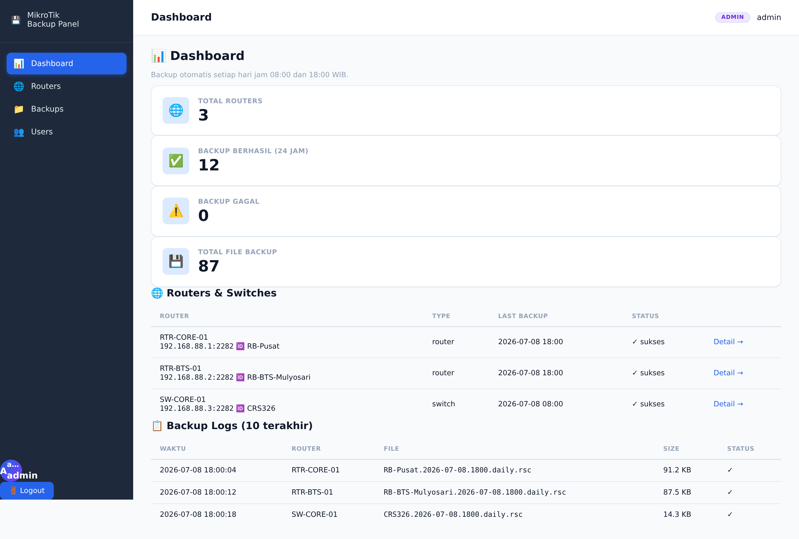
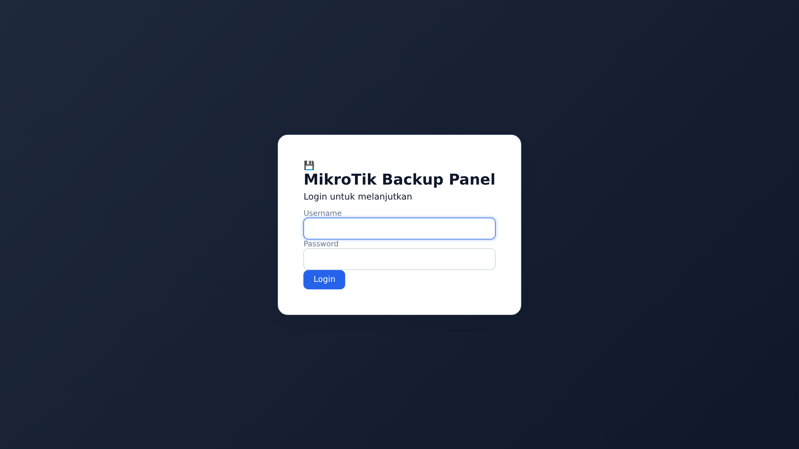
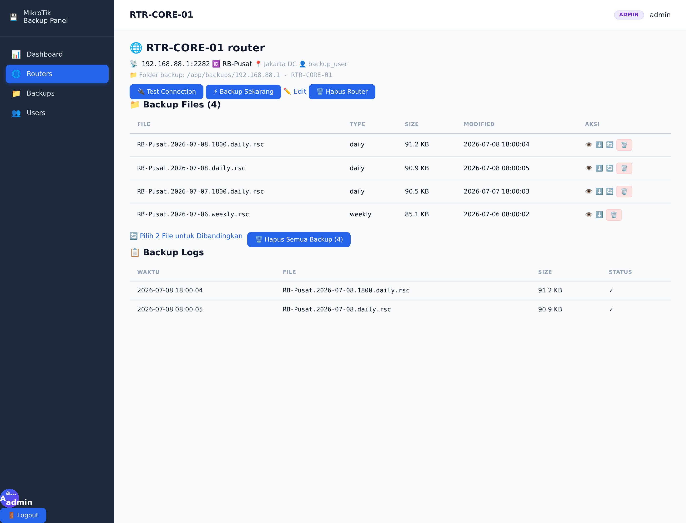
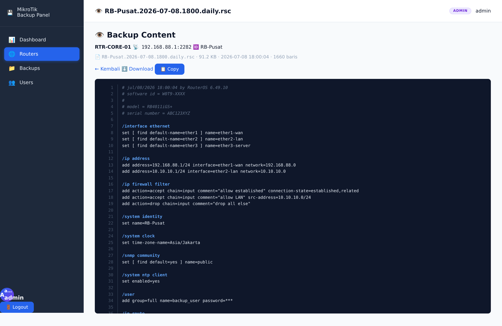
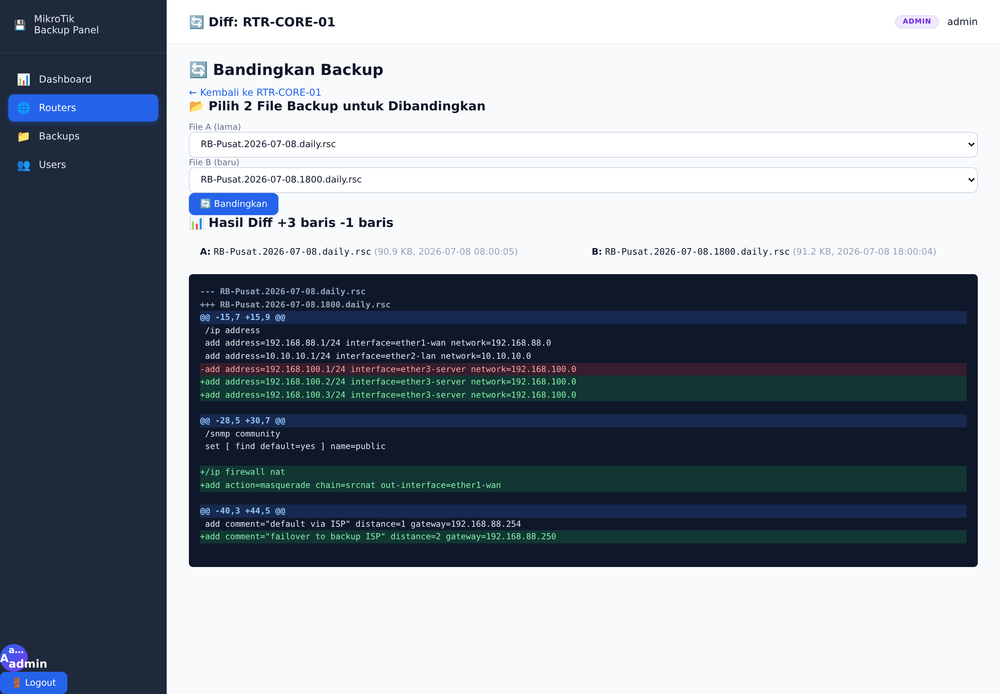
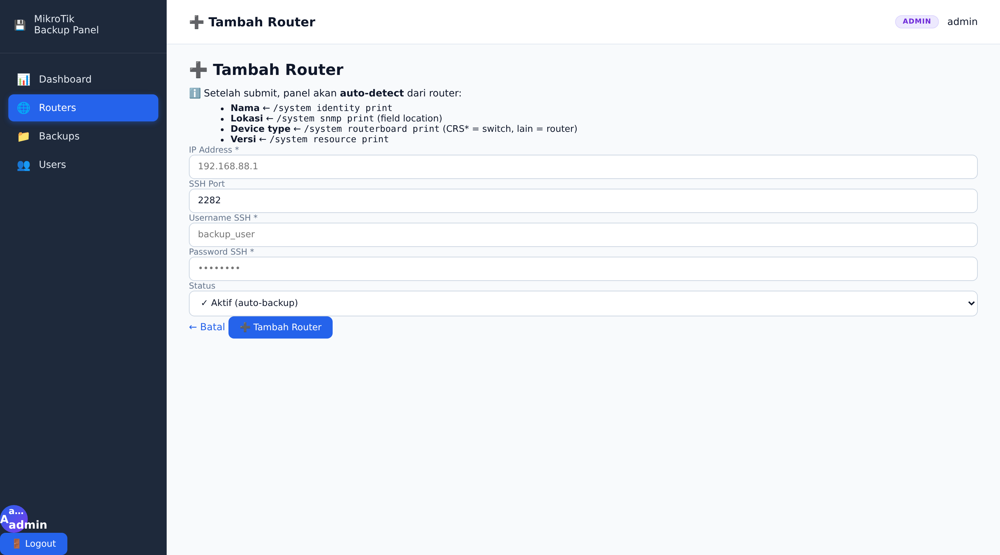
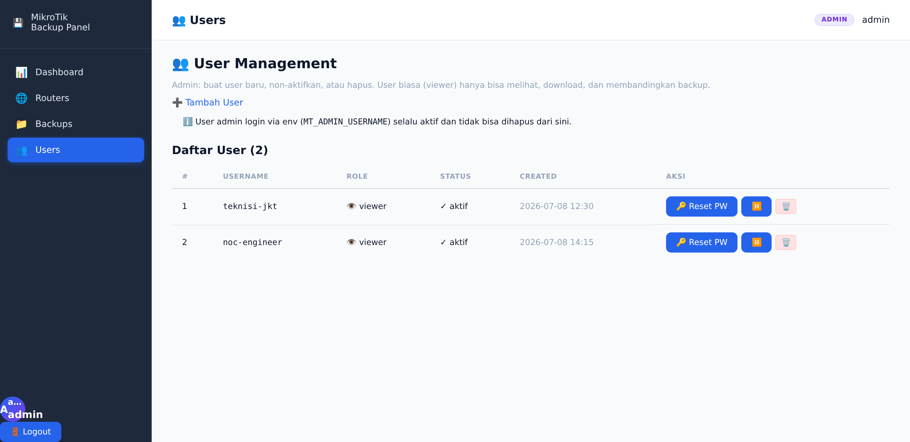
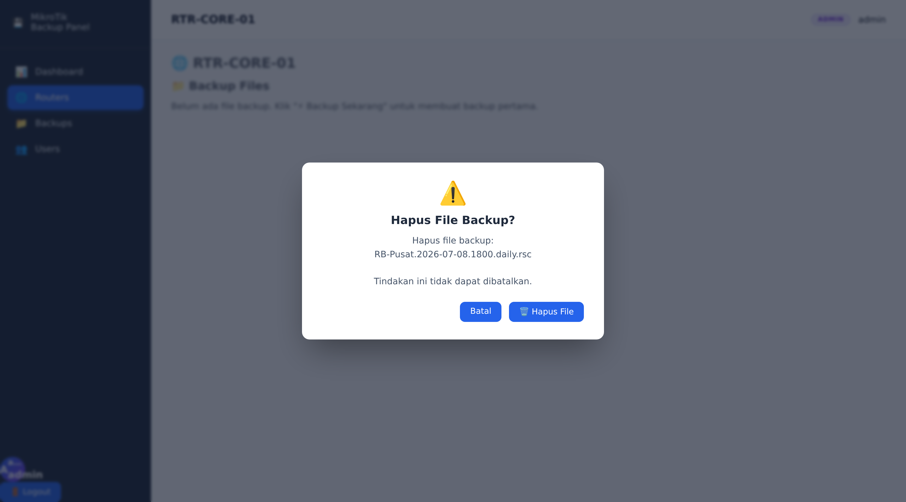

# MikroTik Backup Panel

> Auto-backup & version control panel untuk router MikroTik via SSH.  
> Backup config harian/mingguan/bulanan, **lihat & compare** langsung di browser, multi-user (admin/viewer), deploy pakai Docker.



---

## ✨ Fitur

- 🚀 **Auto-backup** via SSH — fetch `/export` setiap **08:00 & 18:00 WIB** (cron)
- 📁 **Smart naming** — `{Identity}.{YYYY-MM-DD}.{daily/weekly/monthly}.rsc`
- 🪄 **Auto-detect** — nama, lokasi, model, device type langsung dari router pas input (cuma butuh **IP + username + password**)
- 👁 **In-browser viewer** — lihat isi `.rsc` lengkap dengan syntax highlight & line numbers, gak perlu download dulu
- 🔄 **Diff antar backup** — unified diff antar 2 file backup (atau vs prev otomatis), cocok buat audit perubahan config
- 👥 **Multi-user** — admin (full access) + viewer (read-only: lihat/download/diff)
- 🔐 **Path-traversal safe** — semua endpoint file pakai `Path.resolve()` guard
- 💬 **Modal konfirmasi** untuk semua aksi delete (gak ada native browser confirm yg jelek)
- 🎨 **Modern UI** — sidebar dark, top bar, dashboard cards, responsive

---

## 📸 Screenshots

### 🔐 Login


### 📊 Dashboard


### 🌐 Router Detail (admin view)


### 👁 In-browser Backup Viewer (syntax highlight + line numbers)


### 🔄 Diff antar 2 Backup


### ➕ Tambah Router (cuma butuh IP — sisanya auto-detect)


### 👥 User Management (admin only)


### 🗑️ Modal Konfirmasi Delete


---

## 🚀 Quick Install (Docker Compose)

### Prasyarat
- Linux server / VPS (Ubuntu 22.04+ / Debian 12+ recommended)
- Docker + Docker Compose terinstall
- Akses SSH ke MikroTik yang mau di-backup (user + password)
- **Opsional**: Traefik + domain + Cloudflare (untuk HTTPS otomatis via Let's Encrypt)

### 1. Clone repo

```bash
git clone https://github.com/ashadebi/mt-backup.git
cd mt-backup
```

### 2. Generate secrets

Jalankan command berikut dan **simpan output-nya**:

```bash
# Encryption key untuk password router di SQLite
python3 -c "from cryptography.fernet import Fernet; print(Fernet.generate_key().decode())"
# contoh output: TBLeMn…Ce0=

# Session signing key untuk FastAPI
python3 -c "import secrets; print(secrets.token_hex(32))"
# contoh output: b8a4c7…4bee

# Bcrypt hash untuk password admin (ganti YOUR_PASSWORD dengan password yg Bos mau)
python3 -c "import bcrypt; print(bcrypt.hashpw(b'YOUR_PASSWORD', bcrypt.gensalt(rounds=12)).decode())"
# contoh output: $2b$12$Sqn6W632VN1uq/7lb0kzA.K.SNC8xQcvSV1MUN5EV44TdyaaJmJu6
```

### 3. Buat `data/.env`

```bash
mkdir -p data backups
cp .env.example data/.env
nano data/.env
```

Isi dengan output dari step 2:

```ini
MT_FERNET_KEY=<output_step_2_1>
MT_SECRET_KEY=<output_step_2_2>
MT_ADMIN_USERNAME=admin
MT_ADMIN_PASSWORD_HASH=<output_step_2_3>
MT_DATA_DIR=/app/data
MT_BACKUP_DIR=/app/backups
```

### 4a. Deploy standalone (langsung expose port 8000)

Cocok untuk first-time user / testing.

```bash
# Build image
docker compose -f docker-compose.simple.yml build

# Run
docker compose -f docker-compose.simple.yml up -d

# Cek status
docker compose -f docker-compose.simple.yml ps

# Lihat logs
docker compose -f docker-compose.simple.yml logs -f
```

Akses: `http://IP_VPS:8000/` → login pakai `admin` / password dari step 2.

### 4b. Deploy dengan Traefik + HTTPS (production)

Pastikan Traefik v3 sudah running di VPS Bos di network `hosting-public` (atau ganti nama network di `docker-compose.yml`).

Edit `docker-compose.yml` bagian `traefik.http.routers.mt-backup.rule` — ganti `backup.teelee.my.id` dengan domain Bos:

```yaml
labels:
  - traefik.http.routers.mt-backup.rule=Host(`backup.yourdomain.com`)
```

Lalu:

```bash
docker compose up -d --build
docker compose logs -f
```

Akses: `https://backup.yourdomain.com/`

### 5. Setup auto-backup cron (08:00 & 18:00 daily)

Di **host VPS** (bukan di dalam container):

```bash
cat > /etc/cron.d/mt-backup << 'EOF'
# MikroTik Backup Panel — auto-backup at 08:00 and 18:00 daily
SHELL=/bin/bash
PATH=/usr/local/sbin:/usr/local/bin:/sbin:/bin:/usr/sbin:/usr/bin

0 8,18 * * * root docker exec mt-backup python3 /app/scripts/backup.py >> /var/log/mt-backup-cron.log 2>&1
EOF

# Reload cron
systemctl reload cron

# Verify
crontab -l  # atau: cat /etc/cron.d/mt-backup
```

Atau kalau mau test manual:

```bash
docker exec mt-backup python3 /app/scripts/backup.py
```

### 6. Backup retention (optional, default)

Default retention (`app/ssh_backup.py:cleanup_old_backups`):
- **daily**: 7 hari
- **weekly**: 30 hari
- **monthly**: 365 hari

File `.rsc` lebih lama dari itu akan auto-delete pas cron run.

---

## 🔧 Cara Pakai

### ➕ Tambah Router

1. Login sebagai `admin`
2. Klik **"➕ Tambah Router"** di sidebar Routers
3. Isi **cuma 4 field**:
   - **IP Address** — IP MikroTik (contoh: `192.168.88.1`)
   - **SSH Port** — default `22`, sering diset `2282` untuk harden
   - **Username SSH** — user dengan permission `/export`
   - **Password SSH** — password user tsb
4. Klik **➕ Tambah Router**
5. Backend akan **auto-detect** via SSH:
   - **Nama** ← `/system identity print`
   - **Lokasi** ← `/system snmp print` (field location)
   - **Model** ← `/system routerboard print`
   - **Device type** ← prefix model (`CRS*`=switch, lain=router)
   - **Versi** ← `/system resource print`
6. Router langsung muncul di dashboard, backup berikutnya ikut cron

> **Tips**: Untuk auto-detect lokasi, set dulu di router:  
> `/system snmp set location="Ruang Server Lt.3" contact="admin@example.com"`

### 👁 View Backup

1. Buka detail router → tabel **Backup Files**
2. Klik tombol **👁** (eye icon)
3. File `.rsc` terbuka di browser dengan:
   - Line numbers di kiri (sticky)
   - Syntax highlight (comments gray italic, sections biru bold, set statements putih)
   - Dark theme (VS Code style)
   - Tombol **📋 Copy** untuk copy ke clipboard
   - Tombol **⬇️ Download** kalau mau download

### 🔄 Diff Antar Backup

1. Buka detail router → klik **🔄 Pilih 2 File untuk Dibandingkan**
2. Pilih File A (lama) dan File B (baru) dari dropdown
3. Klik **🔄 Bandingkan**
4. Hasil diff muncul dengan:
   - 🟢 Hijau: baris ditambah (hanya di B)
   - 🔴 Merah: baris dihapus (hanya di A)
   - 🔵 Biru: hunk header `@@`
   - Stats: `+N baris / -M baris`
   - Metadata file (size, mtime, download link)

Atau shortcut: tiap row di tabel Backup Files punya tombol **🔄 vs prev** → auto-diff dengan file sebelumnya.

### 👥 Kelola User

1. Login sebagai `admin`
2. Klik **👥 Users** di sidebar
3. **➕ Tambah User**:
   - Username
   - Password
   - Role: `viewer` (lihat/download/diff) atau `admin` (full)
   - Status: aktif/nonaktif
4. Aksi lain per user:
   - **🔑 Reset PW** — modal konfirmasi + set password baru
   - **⏸/▶** — enable/disable user
   - **🗑️** — hapus user (modal konfirmasi)

> **Catatan**: User admin dari env (`MT_ADMIN_USERNAME`) **selalu aktif** dan gak bisa dihapus dari sini — untuk jaga-jaga kalau semua admin DB hilang.

### Permission Matrix

| Aksi | Viewer | Admin |
|---|---|---|
| Lihat dashboard / routers / backups | ✅ | ✅ |
| Lihat isi backup di browser | ✅ | ✅ |
| Download backup file | ✅ | ✅ |
| Bandingkan diff | ✅ | ✅ |
| Trigger backup manual | ❌ | ✅ |
| Test connection | ❌ | ✅ |
| Tambah / edit / hapus router | ❌ | ✅ |
| Hapus file backup | ❌ | ✅ |
| Hapus semua backup | ❌ | ✅ |
| Kelola user | ❌ | ✅ |

---

## 🔐 Security

- **Path traversal protection** di semua endpoint file (`/backups/view`, `/backups/download`, `/backups/delete`, `/backups/delete-all-backups`) — pakai `Path.resolve().startswith(folder.resolve())`
- **Password encrypted** di SQLite pakai Fernet (symmetric encryption)
- **Session middleware** dengan HttpOnly + SameSite cookie
- **CSRF-friendly** (form-based, no JSON APIs that need tokens)
- **Bootstrap admin via env** yang gak bisa di-disable dari UI
- **Role-based permission** di-backend (`require_admin` decorator) — gak bisa dibypass dari UI

### Disable bootstrap admin (opsional, untuk hardening ekstra)

Setelah bikin admin DB, hapus `MT_ADMIN_USERNAME` & `MT_ADMIN_PASSWORD_HASH` dari `data/.env` dan restart. Admin harus via DB.

---

## 📂 Struktur Project

```
mt-backup/
├── app/
│   ├── main.py              # FastAPI app, all routes
│   ├── auth.py              # Login, session, require_admin
│   ├── database.py          # SQLite CRUD
│   ├── ssh_backup.py        # paramiko + MikroTik /export
│   ├── static/
│   │   └── style.css        # All CSS
│   └── templates/
│       ├── base.html        # Layout + sidebar + modal
│       ├── login.html
│       ├── dashboard.html
│       ├── routers.html
│       ├── router_detail.html
│       ├── router_form.html
│       ├── backups.html
│       ├── diff.html
│       ├── users.html
│       ├── user_form.html
│       └── view_backup.html
├── scripts/
│   └── backup.py            # Standalone cron script (di-exec di dalam container)
├── data/                    # SQLite + .env (gitignored)
├── backups/                 # .rsc files (gitignored)
├── Dockerfile
├── docker-compose.yml       # Traefik version
├── docker-compose.simple.yml # Standalone (no Traefik)
├── requirements.txt
├── .env.example
├── LICENSE
└── README.md
```

---

## 🛠 Development (local, tanpa Docker)

```bash
cd mt-backup
python3 -m venv venv
source venv/bin/activate
pip install -r requirements.txt

# Generate dev secrets
export MT_FERNET_KEY=$(python3 -c "from cryptography.fernet import Fernet; print(Fernet.generate_key().decode())")
export MT_SECRET_KEY=$(python3 -c "import secrets; print(secrets.token_hex(32))")
export MT_ADMIN_USERNAME=admin
export MT_ADMIN_PASSWORD_HASH=$(python3 -c "import bcrypt; print(bcrypt.hashpw(b'admin', bcrypt.gensalt(rounds=12)).decode())")

# Run
mkdir -p data backups
uvicorn app.main:app --reload --host 0.0.0.0 --port 8000
```

Akses: `http://localhost:8000/` → login `admin` / `admin`.

---

## 📜 License

MIT — see [LICENSE](LICENSE).

---

## 🙏 Credits

Dibuat oleh [Agoes](https://github.com/ashadebi) untuk backup MikroTik router pribadi/komersial.  
Powered by FastAPI + Paramiko + SQLite. UI vanilla CSS, no framework.

---

## 🐛 Troubleshooting

| Problem | Solusi |
|---|---|
| `MT_ADMIN_USERNAME/PASSWORD_HASH not set` | Edit `data/.env`, isi dari step 2 |
| `SSH connect failed` di auto-detect | Cek IP/port reachable dari container: `docker exec mt-backup nc -zv IP 2282` |
| `Path invalid` di download/view | Bug — laporkan dengan filename yang dicoba |
| `Identity file not accessible` | SSH key host perlu `chmod 600` dan owned by current user |
| Backup gak muncul di dashboard | Cek `/var/log/mt-backup-cron.log` di host + `docker logs mt-backup` |
| Lupa password admin env | Login SSH ke VPS → `cat data/.env` atau buat password baru |

---

## 🗺️ Roadmap

- [ ] Telegram notification kalau ada diff config
- [ ] Per-router schedule (instead of global 08:00/18:00)
- [ ] Encrypted backup (.rsc.enc) untuk compliance
- [ ] Multi-tenancy (multiple orgs)
- [ ] LDAP/SSO integration
- [ ] Audit log export (CSV/JSON)
- [ ] Webhook integration (Slack, Discord)