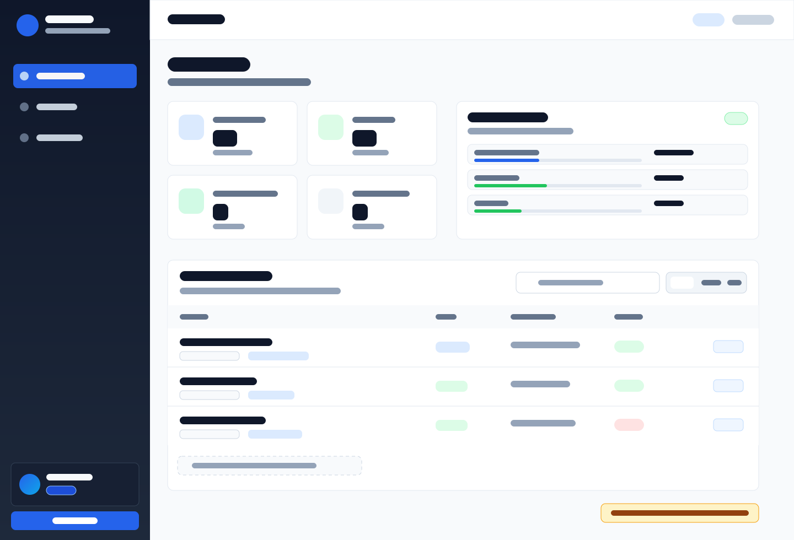

# MikroTik Backup Panel

> Auto-backup router dan switch MikroTik ke VPS, lihat config, download, dan compare perubahan langsung dari browser.

Auto-backup harian (08:00 + 18:00 WIB), dashboard router/switch, role admin/viewer, pencarian device, dan retention backup bertingkat.

---

## 🚀 Quick Install (1 menit)

Punya VPS Debian/Ubuntu + akses root + domain yg sudah pointing ke VPS:

```bash
# Standalone (port 8000, HTTP — cocok untuk testing)
curl -fsSL https://raw.githubusercontent.com/ashadebi/mt-backup/main/scripts/install.sh \
  | sudo bash -s -- --domain backup.example.com --email admin@example.com

# Production (HTTPS via Traefik + Let's Encrypt — DNS A record harus sudah di-set)
curl -fsSL https://raw.githubusercontent.com/ashadebi/mt-backup/main/scripts/install.sh \
  | sudo bash -s -- --domain backup.example.com --email admin@example.com --with-https
```

**Output akhir** akan menampilkan:
- URL panel
- Username admin
- **Password admin random** (ditampilkan sekali di terminal, tidak disimpan)

⚠️ **Catat password-nya sekarang** — kalau hilang, re-run `install.sh --reset-admin`.

---

## ✨ Fitur Singkat

| Fitur | Penjelasan |
|---|---|
| Auto-backup | Cron jalan 2× sehari (08:00 + 18:00 WIB) |
| Router + switch inventory | Router dan switch tampil di dashboard dengan filter `Semua`, `Router`, dan `Switch` |
| Search device | Cari device berdasarkan nama, lokasi, identity, type, atau status backup |
| Auto-detect | Nama, model, lokasi, identity, dan device type auto-detect saat tambah device |
| Auto known_hosts | Host key SSH device baru dipelajari otomatis setelah koneksi sukses |
| Smart location | Lokasi diambil dari SNMP/identity jika tersedia, fallback dari nama host yang dirapikan |
| In-browser viewer | Lihat isi `.rsc` tanpa download |
| Diff config | Bandingkan 2 backup, lihat baris yg berubah |
| Multi-user | Admin (full) + viewer (lihat/download/diff saja) |
| Viewer privacy | Role viewer tidak melihat `IP:Port`, user SSH, folder backup, atau URL backup berbasis IP |
| Backup retention | Saat backup `weekly` sukses, backup `daily` lama device itu dihapus; saat `monthly` sukses, backup `weekly` lama dihapus |
| System resources | Dashboard menampilkan CPU, memory, disk, dan total backup dengan icon + progress bar |
| WIB timezone | Runtime app, log, dan jadwal backup memakai `Asia/Jakarta` |
| Docker | Deploy sekali jalan, gampang update |

---

## 📸 Tampilan

Screenshot contoh di bawah memakai data samaran. IP, username SSH, folder backup, dan nama internal sensitif tidak ditampilkan.

### Dashboard Terbaru


---

## 🛠️ Cara Pakai Setelah Install

1. **Login** di URL yg ditampilkan
2. **Tambah router/switch** pertama: klik `Routers → ➕ Tambah Router`
3. Isi **IP MikroTik + SSH credentials** → klik Tambah
4. Panel akan **auto-detect** nama, model, lokasi, identity, dan type via SSH/SNMP/identity
5. Klik `🔌 Test Connection` lalu `▶ Backup Now` untuk backup pertama
6. Buka router detail → klik `👁` untuk lihat isi `.rsc` di browser
7. Klik `🔄 vs prev` untuk diff dengan backup sebelumnya
8. Pakai pencarian atau tab `Router`/`Switch` untuk fokus ke device tertentu
9. (Optional) Tambah user lain di menu `Users` (admin only)

### Role user

| Role | Akses |
|---|---|
| Admin | Tambah/edit/hapus device, test koneksi, backup manual, hapus file backup, kelola user |
| Viewer | Lihat dashboard, cari/filter device, lihat/download backup, dan diff config |

Viewer sengaja tidak melihat data sensitif seperti `IP:Port`, user SSH, folder backup, dan link backup berbasis IP.

---

## 🔐 Default Schedule

Cron auto-backup default di `/etc/cron.d/mt-backup`:
```
0 8,18 * * *  → 08:00 + 18:00 daily
```

Edit manual kalau mau ganti jam atau per-router:
```bash
sudo nano /etc/cron.d/mt-backup
sudo systemctl reload cron
```

---

## 📂 Where Things Live

| Path | Isi |
|---|---|
| `/opt/mt-backup/` | Project source (Dockerfile, docker-compose, scripts) |
| `/opt/mt-backup/data/.env` | Secrets (Fernet key, session secret, bcrypt admin hash) |
| `/opt/mt-backup/data/panel.sqlite` | Database (routers, users, logs) |
| `/opt/mt-backup/backups/<ip>/` | File backup `.rsc` |
| `/etc/cron.d/mt-backup` | Auto-backup cron |
| `/var/log/mt-backup-cron.log` | Cron execution log |

---

## 🔧 Perintah Harian

```bash
# Login SSH ke VPS dulu, baru:

# Lihat log container
docker logs -f mt-backup

# Restart
docker restart mt-backup

# Update ke versi terbaru
cd /opt/mt-backup && git pull && docker compose -f docker-compose.simple.yml up -d --build
# (atau docker-compose.https.yml jika pakai HTTPS mode)

# Manual backup sekarang (tanpa nunggu cron)
docker exec mt-backup python3 /app/scripts/backup.py

# Reset admin password (password baru ditampilkan di terminal)
curl -fsSL https://raw.githubusercontent.com/ashadebi/mt-backup/main/scripts/install.sh \
  | sudo bash -s -- --reset-admin

# Cek isi .env (gak ada password plaintext — semua sudah di-hash)
sudo cat /opt/mt-backup/data/.env
```

---

## 🆘 Troubleshooting

| Problem | Solusi |
|---|---|
| Lupa password admin | `curl ... install.sh --reset-admin` |
| `permission denied` SSH ke MikroTik | Pastikan user MikroTik punya permission `/export` |
| `Authentication failed` saat test device | Username/password SSH device berbeda; edit device dari dashboard admin |
| Device baru gagal karena known_hosts | Jalankan test/backup ulang; host key dipelajari otomatis saat koneksi sukses |
| Panel gak start | `docker logs mt-backup` — cek error di paling akhir |
| Port 8000 sudah dipakai | Ganti `ports: "8080:8000"` di `docker-compose.simple.yml`, lalu `docker compose up -d` |
| HTTPS gak jadi (LE gagal) | DNS A record belum pointing? cek `dig +short backup.example.com` |
| Ingin ganti HTTPS ke standalone | `docker compose -f docker-compose.https.yml down && docker compose -f docker-compose.simple.yml up -d` |
| Mau pindah dari standalone ke HTTPS | `docker compose -f docker-compose.simple.yml down` dulu, baru re-run `install.sh --with-https` |

---

## 🏗️ Advanced (kalau mau custom config)

<details>
<summary><b>Konfigurasi manual (tanpa install script)</b></summary>

### 1. Clone & setup

```bash
git clone https://github.com/ashadebi/mt-backup.git /opt/mt-backup
cd /opt/mt-backup
mkdir -p data backups
```

### 2. Generate secrets

```bash
# Encryption key (untuk password SSH di SQLite)
python3 -c "from cryptography.fernet import Fernet; print(Fernet.generate_key().decode())"

# Session signing key
python3 -c "import secrets; print(secrets.token_hex(32))"

# Bcrypt hash untuk admin password
python3 -c "import bcrypt; print(bcrypt.hashpw(b'YOUR_PASSWORD', bcrypt.gensalt(rounds=12)).decode())"
```

### 3. Write `data/.env`

```ini
MT_FERNET_KEY=<output_1>
MT_SECRET_KEY=<output_2>
MT_ADMIN_USERNAME=admin
MT_ADMIN_PASSWORD_HASH=<output_3>
MT_PANEL_DOMAIN=backup.example.com
MT_DATA_DIR=/app/data
MT_BACKUP_DIR=/app/backups
```

### 4. Build & start

```bash
docker compose -f docker-compose.simple.yml up -d --build
# atau pakai docker-compose.https.yml untuk HTTPS
```

### 5. Setup cron (opsional)

```bash
cat > /etc/cron.d/mt-backup << 'EOF'
SHELL=/bin/bash
0 8,18 * * * root docker exec mt-backup python3 /app/scripts/backup.py >> /var/log/mt-backup-cron.log 2>&1
EOF
systemctl reload cron
```

</details>

<details>
<summary><b>Stack & dependencies</b></summary>

- **Backend**: FastAPI 0.115 + Uvicorn + Jinja2
- **DB**: SQLite (built-in Python)
- **SSH client**: Paramiko
- **Crypto**: cryptography (Fernet) + bcrypt
- **Container**: python:3.12-slim + tini
- **Reverse proxy** (HTTPS mode): Traefik v3.2 + Let's Encrypt

Lihat `requirements.txt` lengkap.

</details>

<details>
<summary><b>Environment variables</b></summary>

| Variable | Default | Fungsi |
|---|---|---|
| `MT_FERNET_KEY` | (wajib) | Encrypt password SSH yg disimpan di DB |
| `MT_SECRET_KEY` | (wajib) | Session signing key |
| `MT_ADMIN_USERNAME` | `admin` | Username admin env (fallback) |
| `MT_ADMIN_PASSWORD_HASH` | (wajib) | Bcrypt hash admin password |
| `MT_CRON_TOKEN` | random | Token untuk POST /api/backup/run |
| `MT_PANEL_DOMAIN` | - | Domain panel (untuk HTTPS mode) |
| `MT_DATA_DIR` | `/app/data` | Direktori data di dalam container |
| `MT_BACKUP_DIR` | `/app/backups` | Direktori backup di dalam container |

</details>

<details>
<summary><b>API endpoints</b></summary>

| Method | Path | Auth | Fungsi |
|---|---|---|---|
| GET | `/login` | none | Login page |
| POST | `/login` | none | Submit credentials |
| POST | `/logout` | session | Logout |
| GET | `/` | session | Dashboard |
| GET | `/routers` | session | List routers |
| GET | `/routers/{id}` | session | Router detail + backup list |
| GET | `/routers/new` | admin | Form tambah router |
| POST | `/routers/new` | admin | Submit router |
| POST | `/routers/{id}/edit` | admin | Update router |
| POST | `/routers/{id}/delete` | admin | Delete router |
| POST | `/routers/{id}/delete-all-backups` | admin | Hapus semua file backup |
| POST | `/routers/{id}/backup` | admin | Trigger manual backup |
| POST | `/routers/{id}/test` | admin | Test SSH connection |
| GET | `/routers/{id}/diff?a=X&b=Y` | session | Lihat diff |
| GET | `/routers/{id}/backups/view?filename=Y` | session | Lihat isi `.rsc` tanpa membuka IP di URL |
| GET | `/routers/{id}/backups/download?filename=Y` | session | Download `.rsc` tanpa membuka IP di URL |
| GET | `/backups` | session | List semua backup semua router |
| GET | `/backups?router_id=X` | session | Filter backup per device tanpa memakai IP |
| GET | `/backups/view?ip=X&filename=Y` | session | Lihat isi `.rsc` |
| GET | `/backups/download?ip=X&filename=Y` | session | Download `.rsc` |
| POST | `/backups/delete?ip=X&filename=Y` | admin | Hapus 1 file |
| GET | `/users` | admin | List users |
| POST | `/users/new` | admin | Tambah user |
| POST | `/users/{id}/toggle` | admin | Enable/disable user |
| POST | `/users/{id}/delete` | admin | Hapus user |
| POST | `/users/{id}/reset-password` | admin | Reset password user |
| GET | `/healthz` | none | Healthcheck |
| POST | `/api/backup/run` | token | Trigger via API (cron replacement) |

</details>

---

## 📜 License

MIT — see [LICENSE](LICENSE).

---

## 🙏 Credits

By [Agoes](https://github.com/ashadebi). FastAPI + Paramiko + SQLite + vanilla CSS.
